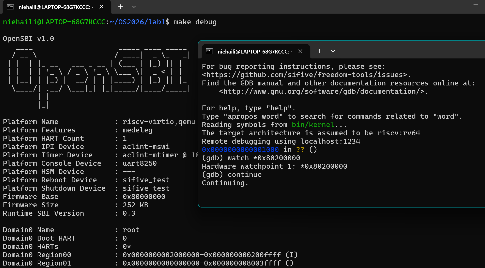

# Lab1 实验报告分工说明

> 三人都需要独立完成练习1、练习2的实际操作（读代码 + 跑通GDB调试），
> 报告只是按下面分工各写各的部分，最后由负责整合的同学拼成一份完整的 report.md。

---


## 四、实验内容与实现（练习2）

### 1. 实验目的
使用 GDB 跟踪 QEMU 模拟的 RISC-V 从加电开始，直到执行内核第一条指令（跳转到 `0x80200000`）的整个过程，熟悉 QEMU 与 GDB 的联合调试方法，并理解 RISC-V 硬件复位后 OpenSBI 的初始化逻辑。

### 2. 调试过程与现象记录

#### （1）连接 QEMU 并停在复位地址
在终端执行 `make gdb`，GDB 自动通过 `target remote localhost:1234` 连接到 QEMU。
连接成功后，观察当前状态：
- PC 寄存器停留在 `0x1000`，这是 RISC-V 硬件加电后的复位地址。
- 此时 GDB 提示 `Reading symbols from bin/kernel...`，但当前仍在 OpenSBI 固件阶段。
> 

#### （2）查看复位地址的初始化指令
使用 `x/10i $pc` 查看 `0x1000` 处的汇编指令：
```assembly
=> 0x1000:  auipc t0, 0x0
   0x1004:  addi  a2, t0, 40
   0x1008:  csrr  a0, mhartid
   0x100c:  ld    a1, 32(t0)
   0x1010:  ld    t0, 24(t0)
   0x1014:  jr    t0
   0x1018:  unimp
   0x101a:  0x8000
   0x101c:  unimp
   0x101e:  unimp
```
>  

addi 和 ld 指令在 a1、a2 等寄存器中准备好设备树指针等启动参数。最关键的是，代码通过 ld t0, 24(t0) 从 0x1018 处加载了 OpenSBI 主入口地址 0x80000000，最后执行 jr t0 完成向主固件的跳转。

为了探究跳转目标，使用 `x/1gx 0x1018` 查看 `ld t0, 24(t0)` 将要加载的内存数据：
```text
0x1018: 0x0000000080000000
```
这说明执行完 `jr t0` 后，程序将跳转到 `0x80000000`（OpenSBI 主引导代码的入口）。
>  
RISC-V 加电后的复位代码位于 0x1000。该段代码通过 auipc 获取当前基址，利用 csrr 读取核心 ID 并存入 a0，并通过 

在查看 0x1000 处的复位指令时，发现 0x1018 处显示为 unimp（未实现指令）和 0x8000。结合 x/1gx 0x1018 观察到该地址存放的是 0x0000000080000000，这并非可执行代码，而是 jr t0 要跳转的基址。因为 GDB 误将数据段当作代码段反汇编，全 0 的数据被解析为了 unimp。这也侧面印证了 0x1018 处是跳转数据，而非指令。

#### （3）使用 `watch` 观察内核被加载到内存
为了避免单步跟踪大量 OpenSBI 代码，在 GDB 中设置硬件观察点：
```gdb
(gdb) watch *0x80200000
Hardware watchpoint 1: *0x80200000
(gdb) continue
```
等待一段时间后，OpenSBI 开始将操作系统内核加载到内存，当向 `0x80200000` 地址写入数据时，观察点被触发：
```text
Hardware watchpoint 1: *0x80200000
Old value = 0
New value = ...
```
>  

#### （4）使用断点验证内核开始执行
删除观察点，并在内核入口地址 `0x80200000` 处设置断点，然后继续执行：
```gdb
(gdb) delete
(gdb) b *0x80200000
Breakpoint 2 at 0x80200000
(gdb) continue
```
断点命中后，PC 指针已成功跳转至 `0x80200000`，控制权正式由 OpenSBI 移交给内核。
```gdb
Breakpoint 2, 0x0000000080200000 in ?? ()
(gdb) info registers pc
pc             0x80200000       0x80200000
```
>  

### 3. 思考题解答
**问题1：RISC-V 硬件加电后最初执行的几条指令位于什么地址？**
答：位于 `0x1000`（复位地址）。根据实验观察，`0x1000` 到 `0x1014` 是复位后最先执行的一小段代码，随后通过 `jr t0` 跳转到 `0x80000000`。

**问题2：这些指令主要完成了哪些功能？**
答：这些指令是 OpenSBI 最底层的固件初始化代码（通常称为 `_start` 或复位向量），主要完成了以下功能：
1. **建立基础寻址**：通过 `auipc t0, 0x0` 获取当前 PC 的高位基址。
2. **准备参数**：
   - `addi a2, t0, 40`：将 `a2` 指向 `0x1028`，通常用于传递设备树（FDT）的地址或其他配置信息。
   - `csrr a0, mhartid`：读取当前 Hart（硬件线程）的 ID 存入 `a0`，用于后续的多核启动管理。
   - `ld a1, 32(t0)`：从 `0x1020` 处加载数据到 `a1`。
3. **跳转到主固件**：通过 `ld t0, 24(t0)` 从 `0x1018` 处读取 `0x80000000` 作为跳转目标，最后通过 `jr t0` 跳转到 OpenSBI 的主初始化代码入口，进入更高级别的硬件初始化。

---

## 五、测试与验证

1. **验证复位地址**：通过 `make gdb` 连接后，GDB 首行输出 `0x0000000000001000 in ?? ()`，并执行 `info registers pc` 确认 PC 值为 `0x1000`，证明 CPU 确实从复位向量开始执行。
2. **验证跳转逻辑**：反汇编 `0x1000` 发现 `ld t0, 24(t0)` 配合 `jr t0`，并使用 `x/1gx 0x1018` 验证加载的值为 `0x80000000`，证明硬件复位后通过该指令序列跳入 OpenSBI。
3. **验证内核加载与移交**：通过 `watch *0x80200000` 观察到内核被拷贝至 DRAM 的瞬间，随后使用 `b *0x80200000` 成功拦截，GDB 显示 `pc = 0x80200000`，完美验证了从 OpenSBI 到内核启动的完整流程。

---

## Prompt 记录

**用户 Prompt：**
> gdb怎么退出

**AI 回复摘要：**
在 GDB 的 `(gdb)` 提示符下，输入：

```gdb
quit
```

或简写：

```gdb
q
```

然后回车即可退出。

如果正在调试程序，GDB 会提示：

```text
A debugging session is active.
Quit anyway? (y or n)
```

输入 `y` 再回车即可。

另外也可以按 `Ctrl + D` 退出。  
如果程序正在运行，先按 `Ctrl + C` 中断，再输入 `quit`。注意：GDB 里一般不用 `exit`。
**用户 Prompt：**
> 汇编代码里面的unimp是什么

**AI 回复摘要：**
在 RISC-V 汇编（以及 GDB 的反汇编输出）中，**`unimp` 是 "unimplemented"（未实现）的缩写，它是一个伪指令（Pseudo-instruction）**。

在你的实验场景下，了解它的含义非常重要，这里为你详细梳理：

### 1. `unimp` 的本质
*   **机器码**：在 32 位 RISC-V 架构中，标准的 `unimp` 指令通常会被汇编器翻译为全 0 的机器码，即 `0x00000000`。如果开启了压缩指令集（C 扩展），16 位的 `unimp` 对应 `0x0000`。
*   **作用**：它不是用来执行实际计算的。它的主要作用是作为**占位符**，或者作为**错误陷阱**。如果 CPU 试图执行一条 `unimp` 指令（即执行了全 0 的内存区域），会立刻触发一个**非法指令异常（Illegal Instruction Exception / Trap）**，从而让操作系统或调试器（GDB）接管，防止程序跑飞。

### 2. 为什么你的截图里会出现 `unimp`？
这里有一个非常关键的细节：

回顾你在 GDB 中输入的命令：
```gdb
(gdb) x/10i $pc
=> 0x1000:  ...
   0x1014:  jr t0
   0x1018:  unimp
   0x101a:  0x8000
   0x101c:  unimp
```
随后你使用 `x/1gx 0x1018` 查看内存，发现：
```gdb
0x1018: 0x0000000080000000
```

**真相是：`0x1018` 处存放的根本不是代码，而是数据。**
`0x0000000080000000` 是 `ld t0, 24(t0)` 提前加载好的跳转目标地址（OpenSBI 的入口地址）。`jr t0` 会跳转到这个地址。

但是，GDB 的 `x/10i` 命令（examine 10 instructions）不知道这是数据，它**强行把这块内存当成了指令来反汇编**。
*   因为 RISC-V 是小端序（Little-Endian），`0x0000000080000000` 在内存中按低地址到高地址排列是：`00 00 00 00 80 00 00 00`。
*   GDB 按 16 位（2 字节）或 32 位解析时，前两字节 `0x0000` 正好被解析为 16 位的 `unimp` 或 32 位 `unimp` 的一部分。
*   后面的 `0x8000` 因为构不成合法的 RISC-V 指令，GDB 直接输出了它的十六进制值。

因此，`0x1018` 到 `0x101e` 的 `unimp` 和 `0x8000`，实际上是 `jr t0` 跳转目标地址（`0x80000000`）的数据反汇编乱码。
---


