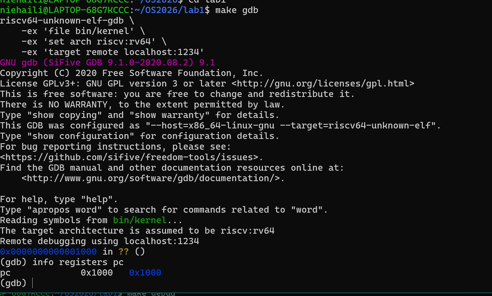
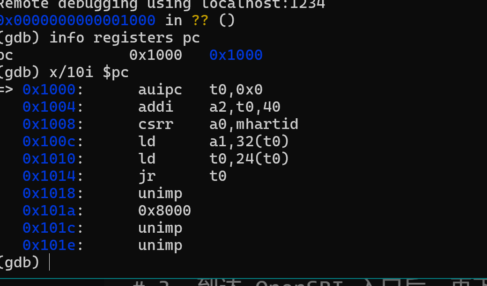
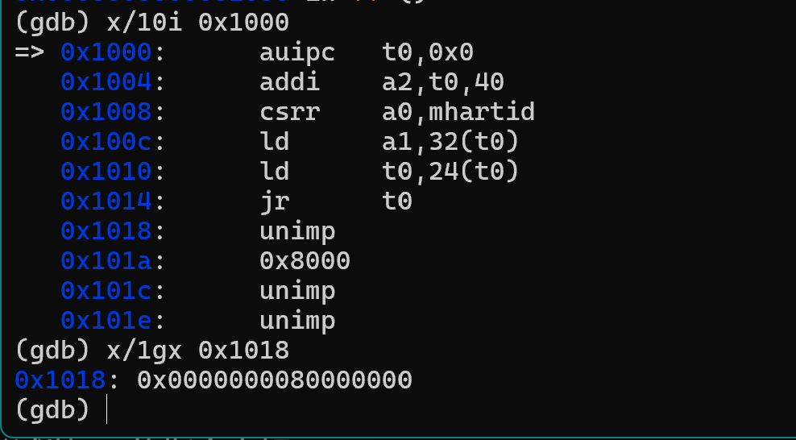
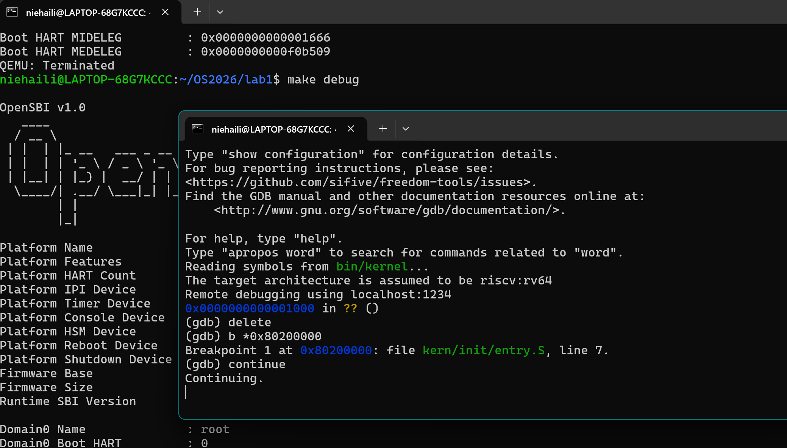
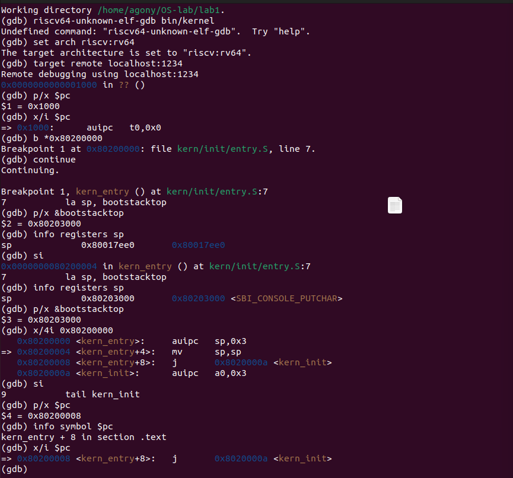
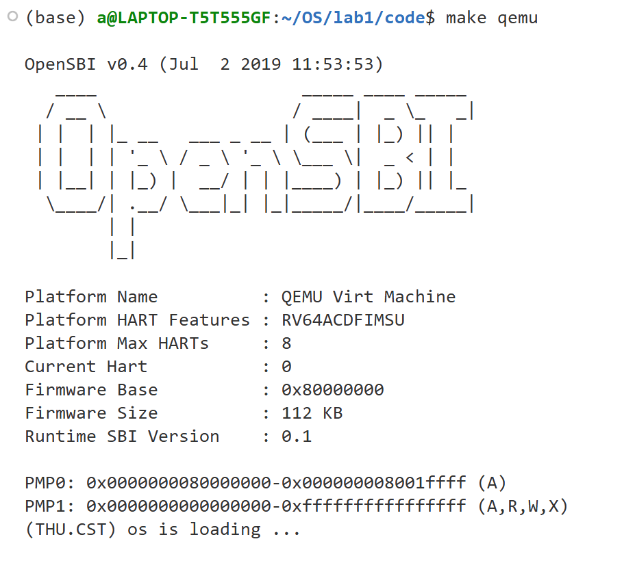

# 操作系统实验报告

## 实验基本信息

| 项目 | 内容 |
|------|------|
| **实验名称** | Lab 1: 最小可执行内核 |
| **小组成员** | 2411033-季艾佳、2412102-聂海丽、2413346-易响 |
| **完成日期** | 2026-09-30 |

### 小组分工

**练习如何分工？**

三名成员共同完成本次实验的全部练习（练习1、练习2），均独立阅读 `entry.S` 代码、独立完成 GDB 调试全过程，确保每个人都完整掌握 lab1 的核心内容。

**实验报告如何分工？**

| 成员 | 负责撰写的报告内容 |
|------|----------------|
| 2413346-易响 | 练习1：entry.S 程序入口解读（含对应测试截图） |
| 2412102-聂海丽 | 练习2：GDB 调试验证启动流程（含对应测试截图） |
| 2411033-季艾佳 | 实验目的、实验环境、整体逻辑分析、测试与验证（整合）、实验总结与收获、全篇最终整合排版、也就是除了练习外的全部 |
---

## 一、实验目的

<!-- 说明本次实验的主要目标和预期成果 -->

本实验的主要目的是：

1. 目的1：掌握 RISC-V 架构下计算机系统从加电复位到进入操作系统内核第一条指令的完整启动流程。
2. 目的2：理解链接脚本控制 ELF 可执行文件的数据段分布与物理内存映射机制。
3. 目的3：部署 QEMU 模拟器与 GDB 调试器，追踪 CPU 寄存器状态与内存交互逻辑。

---

## 二、实验环境

你们使用的 AI 工具

| 成员 | AI 编程工具 | 底层模型 | 备注 |
|------|------------|---------|------|
| 2411033-季艾佳 | Cline（VS Code插件） | GPT-5.5| |
| 2412102-聂海丽 |claudecode |deepseekv4flash | |
| 2413346-易响 | DeepSeek Harness| DeepSeek-V4-Flash| |

**说明：**
- **AI 编程工具**：指具体使用的终端工具、编辑器插件、桌面应用或浏览器界面
- **底层模型**：指该工具使用的大语言模型及版本

---

## 三、实验整体逻辑分析

### 2.1 本章节的逻辑主线

本章实验围绕机器控制权移交核心主线展开。 操作系统需要外部程序将其从硬盘加载至物理内存执行。 本实验探究 QEMU 模拟环境利用 OpenSBI 固件替代传统 BIOS 完成硬件初始化，将 CPU 运行级别与执行指针移交给 C 语言编写的 OS 内核入口。

### 2.2 功能的逐步实现

本章实验按照理论认知、代码分析、编译调试的顺序逐步完成：

1. **梳理整体运转流程**：阅读实验指导书，明确机器启动的完整执行流。 运转流程为：加电复位 → CPU从0x1000进入MROM → 跳转到0x80000000(OpenSBI) → OpenSBI初始化并加载内核到0x80200000 → 跳转到entry.S → 调用kern_init() → 输出信息 → 结束。
2. **理解最小内核核心机制**：梳理完运转流程之后，了解最小内核里的两项关键工作。 一是设定内核的内存布局和入口点。 二是通过 OpenSBI 层层封装输入输出函数。
3. **编译启动与练习验证**：最后使用 Makefile 完成程序编译，启动 QEMU。 结合前置理论知识，完成最终的 GDB 调试验证练习。

---

## 四、实验内容与实现

<!-- 
说明：本部分按照 exercises 文档中的练习顺序组织
每个功能模块或者练习中可能包含多项任务，请根据实际情况调整
-->


### 练习：练习1

**负责人：** 2413346-易响

#### 1. 实验目的
阅读 kern/init/entry.S内容代码，结合操作系统内核启动流程， 理解内核启动中的程序入口操作

#### 2. 调试过程与现象记录

```c
#include <mmu.h>
#include <memlayout.h>

    .section .text,"ax",%progbits
    .globl kern_entry
kern_entry:
    la sp, bootstacktop

    tail kern_init

.section .data
    # .align 2^12
    .align PGSHIFT
    .global bootstack
bootstack:
    .space KSTACKSIZE
    .global bootstacktop
bootstacktop:
```


##### （1）解释指令 la sp, bootstacktop 

`la` 是 RISC-V 汇编中的伪指令，其作用是将符号 `bootstacktop` 的地址加载到寄存器中。因此这条指令可以理解为：sp    ← bootstacktop，就是将内核启动栈的栈顶地址设置到栈指针寄存器 `sp` 中。  

这样做的目的，是为后续执行 C 语言代码建立一个可用的内核栈环境。OpenSBI 将控制权交给内核时，内核刚刚开始执行，此时还没有准备好自己的 C 语言运行环境，而函数调用、局部变量以及寄存器保存等操作都需要依赖栈。因此，内核必须先设置好 `sp`，才能安全地进入后续的 `kern_init()` 函数。  

##### （2）解释指令 tail kern_init  
`tail kern_init` 的作用是：将处理器的控制权从内核启动入口 `kern_entry` 直接转移到 C 语言编写的 `kern_init()` 函数。

这里的 `tail` 可以理解为一种**尾调用（tail call）**。和普通的函数调用不同，它不需要为当前函数保留一个等待返回的调用现场，而是直接跳转到目标函数。也就是说，内核启动流程可以理解为：

```
OpenSBI
   ↓
0x80200000
   ↓
kern_entry
   ↓
设置 sp
   ↓
tail kern_init
   ↓
kern_init()
```
这里采用 `tail` 形式而不是普通函数调用，是因为 `kern_init()` 不会返回，其内部最终进入无限循环，因此没有必要保留返回到 `kern_entry` 的调用关系。换言之，`tail kern_init` 的主要目的是在内核栈初始化完成后，将执行流程正式交给内核的 C 语言初始化代码

---

### 练习：练习2

**负责人：** 2412102-聂海丽

#### 1. 实验目的
使用 GDB 跟踪 QEMU 模拟的 RISC-V 从加电开始，直到执行内核第一条指令（跳转到 `0x80200000`）的整个过程，熟悉 QEMU 与 GDB 的联合调试方法，并理解 RISC-V 硬件复位后 OpenSBI 的初始化逻辑。

#### 2. 调试过程与现象记录

##### （1）连接 QEMU 并停在复位地址
在终端执行 `make gdb`，GDB 自动通过 `target remote localhost:1234` 连接到 QEMU。
连接成功后，观察当前状态：
- PC 寄存器停留在 `0x1000`，这是 RISC-V 硬件加电后的复位地址。
- 此时 GDB 提示 `Reading symbols from bin/kernel...`，但当前仍在 OpenSBI 固件阶段。
> 

##### （2）查看复位地址的初始化指令
使用 `x/10i $pc` 查看 `0x1000` 处的汇编指令：
```assembly
=> 0x1000:  auipc t0, 0x0
   0x1004:  addi  a2, t0, 40
   0x1008:  csrr  a0, mhartid
   0x100c:  ld    a1, 32(t0)
   0x1010:  ld    t0, 24(t0)
   0x1014:  jr    t0
   0x1018:  unimp
   0x101a:  0x8000
   0x101c:  unimp
   0x101e:  unimp
```
>  

addi 和 ld 指令在 a1、a2 等寄存器中准备好设备树指针等启动参数。最关键的是，代码通过 ld t0, 24(t0) 从 0x1018 处加载了 OpenSBI 主入口地址 0x80000000，最后执行 jr t0 完成向主固件的跳转。

为了探究跳转目标，使用 `x/1gx 0x1018` 查看 `ld t0, 24(t0)` 将要加载的内存数据：
```text
0x1018: 0x0000000080000000
```
这说明执行完 `jr t0` 后，程序将跳转到 `0x80000000`（OpenSBI 主引导代码的入口）。
>  
RISC-V 加电后的复位代码位于 0x1000。该段代码通过 auipc 获取当前基址，利用 csrr 读取核心 ID 并存入 a0，并通过 

在查看 0x1000 处的复位指令时，发现 0x1018 处显示为 unimp（未实现指令）和 0x8000。结合 x/1gx 0x1018 观察到该地址存放的是 0x0000000080000000，这并非可执行代码，而是 jr t0 要跳转的基址。因为 GDB 误将数据段当作代码段反汇编，全 0 的数据被解析为了 unimp。这也侧面印证了 0x1018 处是跳转数据，而非指令。

##### （3）使用 `watch` 观察内核被加载到内存
为了避免单步跟踪大量 OpenSBI 代码，在 GDB 中设置硬件观察点：
```gdb
(gdb) watch *0x80200000
Hardware watchpoint 1: *0x80200000
(gdb) continue
```
等待一段时间后，OpenSBI 开始将操作系统内核加载到内存，当向 `0x80200000` 地址写入数据时，观察点被触发：
```text
Hardware watchpoint 1: *0x80200000
Old value = 0
New value = ...
```
>  

##### （4）使用断点验证内核开始执行
删除观察点，并在内核入口地址 `0x80200000` 处设置断点，然后继续执行：
```gdb
(gdb) delete
(gdb) b *0x80200000
Breakpoint 2 at 0x80200000
(gdb) continue
```
断点命中后，PC 指针已成功跳转至 `0x80200000`，控制权正式由 OpenSBI 移交给内核。
```gdb
Breakpoint 2, 0x0000000080200000 in ?? ()
(gdb) info registers pc
pc             0x80200000       0x80200000
```
>  

#### 3. 思考题解答
**问题1：RISC-V 硬件加电后最初执行的几条指令位于什么地址？**
答：位于 `0x1000`（复位地址）。根据实验观察，`0x1000` 到 `0x1014` 是复位后最先执行的一小段代码，随后通过 `jr t0` 跳转到 `0x80000000`。

**问题2：这些指令主要完成了哪些功能？**
答：这些指令是 OpenSBI 最底层的固件初始化代码（通常称为 `_start` 或复位向量），主要完成了以下功能：
1. **建立基础寻址**：通过 `auipc t0, 0x0` 获取当前 PC 的高位基址。
2. **准备参数**：
   - `addi a2, t0, 40`：将 `a2` 指向 `0x1028`，通常用于传递设备树（FDT）的地址或其他配置信息。
   - `csrr a0, mhartid`：读取当前 Hart（硬件线程）的 ID 存入 `a0`，用于后续的多核启动管理。
   - `ld a1, 32(t0)`：从 `0x1020` 处加载数据到 `a1`。
3. **跳转到主固件**：通过 `ld t0, 24(t0)` 从 `0x1018` 处读取 `0x80000000` 作为跳转目标，最后通过 `jr t0` 跳转到 OpenSBI 的主初始化代码入口，进入更高级别的硬件初始化。

---

## 五、测试与验证


### 练习一



为了验证 `entry.S` 中两条指令的实际执行效果，使用 QEMU 和 RISC-V GDB 对内核启动过程进行单步调试。

#### 1. 验证 `la sp, bootstacktop`

首先启动 QEMU 调试模式，并使用 GDB 连接：

```gdb
set arch riscv:rv64
target remote localhost:1234
```

连接成功后，GDB 显示：

```text
0x0000000000001000 in ?? ()
```

随后设置内核入口断点：

```gdb
b *0x80200000
continue
```

程序停在：

```text
Breakpoint 1, kern_entry () at kern/init/entry.S:7
7    la sp, bootstacktop
```

此时查看 `bootstacktop`：

```gdb
p/x &bootstacktop
```

得到：

```text
$2 = 0x80203000
```

在执行 `la sp, bootstacktop` 之前查看 `sp`：

```gdb
info registers sp
```

得到：

```text
sp = 0x80017ee0
```

然后执行单步：

```gdb
si
```

再次查看 `sp`：

```gdb
info registers sp
```

得到：

```text
sp = 0x80203000
```

再次查看：

```gdb
p/x &bootstacktop
```

结果为：

```text
$3 = 0x80203000
```

因此本次实验实际观察到：

```text
执行前：
sp           = 0x80017ee0
bootstacktop = 0x80203000

执行 la 后：
sp           = 0x80203000
bootstacktop = 0x80203000
```

说明执行 `la sp, bootstacktop` 后，`sp` 的值发生了变化，并与 `bootstacktop` 的地址一致。


进一步查看 `kern_entry` 的反汇编：

```gdb
x/4i 0x80200000
```

得到：

```text
0x80200000 <kern_entry>:    auipc sp,0x3
0x80200004 <kern_entry+4>:  mv    sp,sp
0x80200008 <kern_entry+8>:  j     0x8020000a <kern_init>
0x8020000a <kern_init>:     auipc a0,0x3
```

可以看到 `la sp, bootstacktop` 对应的实际机器指令位于 `0x80200000` 和 `0x80200004`。

------

#### 2. 验证 `tail kern_init`

在执行完 `la sp, bootstacktop` 后，继续使用 GDB 单步执行。


执行：

```gdb
si
```

此时 GDB 停在：

```text
0x0000000080200008 in kern_entry () at kern/init/entry.S:9
9    tail kern_init
```

查看当前 PC：

```gdb
p/x $pc
```

得到：

```text
$4 = 0x80200008
```

查看当前指令：

```gdb
x/i $pc
```

得到：

```text
=> 0x80200008 <kern_entry+8>:    j 0x8020000a <kern_init>
```

再次执行：

```gdb
si
```

GDB 进入：

```text
kern_init () at kern/init/init.c:8
8    memset(edata, 0, end - edata);
```

此时查看 PC：

```gdb
p/x $pc
```

得到：

```text
$5 = 0x8020000a
```

查看当前指令：

```gdb
x/4i $pc
```

得到：

```text
0x8020000a <kern_init>:    auipc a0,0x3
0x8020000e <kern_init+4>:  addi  a0,a0,-2
0x80200012 <kern_init+8>:  auipc a2,0x3
0x80200016 <kern_init+12>: addi  a2,a2,-10
```

因此实际执行过程为：

```text
PC = 0x80200008
        ↓
j 0x8020000a
        ↓
PC = 0x8020000a
        ↓
进入 kern_init()
```

由 GDB 单步结果可以确认，执行 `tail kern_init` 对应的跳转指令后，程序从 `kern_entry` 进入了 `kern_init()`。

------

#### 3. 验证结果

本次调试得到的关键结果如下：

| 验证内容            | 实际结果      |
| ------------------- | ------------- |
| `bootstacktop` 地址 | `0x80203000`  |
| `la` 执行前 `sp`    | `0x80017ee0`  |
| `la` 执行后 `sp`    | `0x80203000`  |
| `tail` 执行前 PC    | `0x80200008`  |
| `tail` 执行后 PC    | `0x8020000a`  |
| `tail` 后所在函数   | `kern_init()` |

因此，本次实验通过 GDB 对 `entry.S` 中两条关键指令进行了实际单步验证，并观察到了寄存器和程序计数器在执行前后的变化。

---


### 练习二
1. **验证复位地址**：通过 `make gdb` 连接后，GDB 首行输出 `0x0000000000001000 in ?? ()`，并执行 `info registers pc` 确认 PC 值为 `0x1000`，证明 CPU 确实从复位向量开始执行。
2. **验证跳转逻辑**：反汇编 `0x1000` 发现 `ld t0, 24(t0)` 配合 `jr t0`，并使用 `x/1gx 0x1018` 验证加载的值为 `0x80000000`，证明硬件复位后通过该指令序列跳入 OpenSBI。
3. **验证内核加载与移交**：通过 `watch *0x80200000` 观察到内核被拷贝至 DRAM 的瞬间，随后使用 `b *0x80200000` 成功拦截，GDB 显示 `pc = 0x80200000`，完美验证了从 OpenSBI 到内核启动的完整流程。
### 内核启动成功证明
>  
---

## 六、实验总结与收获

### 对操作系统的理解

**1. 实验重要知识点与 OS 原理的对应**

*   **OpenSBI 固件与 Bootloader**
    *   **含义与关系**：实验中的 OpenSBI 负责初始化 RISC-V 硬件，并将内核镜像加载至物理内存 `0x80200000` 处。 对应 OS 原理中的 BIOS 与 Bootloader 概念。
    *   **差异**：OS 原理通常将 Bootloader 描述为单纯的加载器。 实验中的 OpenSBI 驻留在最高特权级（M 模式），除了引导操作系统，还作为底层服务提供者，拦截处理内核态（S 模式）发出的 SBI 请求。

*   **内存布局与链接脚本**
    *   **含义与关系**：实验使用 `kernel.ld` 链接脚本静态定义 `.text`、`.data`、`.bss` 等代码段与数据段的具体内存映射地址。 对应 OS 原理中程序加载与内存空间分配理论。
    *   **差异**：理论课程侧重逻辑分段概念。实验揭示了物理映射细节，展示工具链如何将结构复杂的 ELF 文件剥离转换为结构扁平的二进制（bin）镜像，从而适应硬件启动初期的内存加载限制。

*   **特权级转换与汇编调用**
    *   **含义与关系**：实验通过内联汇编封装 `ecall` 指令，跨越特权级调用 OpenSBI 提供的字符打印函数。 对应 OS 原理中的内核态切换与系统调用机制。
    *   **差异**：原理课程探讨用户进程调用操作系统内核。实验演示了操作系统内核自身作为调用方，向底层硬件控制权模块（M 模式）请求服务，证实不同层级的权限跨越依赖相同的硬件 Trap 机制。

**2. 本实验尚未涉及的重要 OS 原理知识点**

*   **进程与多任务并发**：本实验内核启动完毕后依靠 `while(1)` 维持单一执行流。 尚未涉及进程控制块（PCB）的构建、进程状态转换管理以及多进程调度的切换逻辑。
*   **虚拟内存与多级存储**：当前内核直接访问 `0x80200000` 等绝对物理地址。 系统尚未挂载内存管理单元（MMU），未建立页表映射关系，缺乏虚拟地址空间抽象和多级存储体系的支持。
*   **中断与异常响应机制**：本实验内核未设置陷入处理入口。 操作系统无法响应定时器中断、外部设备输入或处理执行过程中的异常错误。

### AI 协作开发的经验

本次 Lab1 侧重于启动流程的理论验证，尚未涉及具体的内核代码编写与深度排错。因此，我们团队与 AI 的协作主要集中在以下两个层面：

*   **环境配置排障**：使用 AI 工具辅助搭建交叉编译工具链，并快速定位及解决 QEMU 模拟器与 GDB 远程连接配置过程中的环境依赖或报错问题。
*   **指导书概念解析**：借助 AI 分析实验指导书中的复杂逻辑。针对 MROM 启动、OpenSBI 状态移交以及链接脚本（`kernel.ld`）等知识点，通过提问让 AI 辅助释义，补全前置理论盲区。

---

